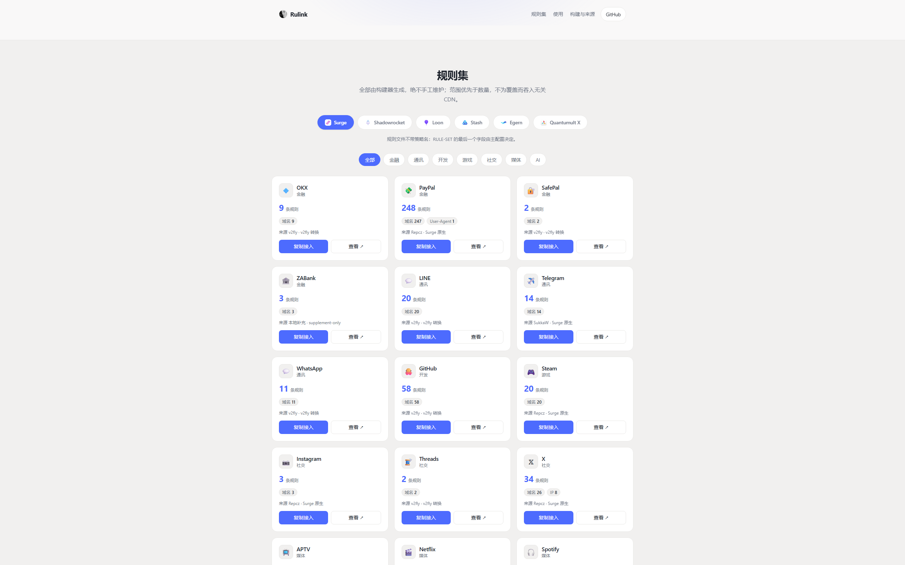

<div align="center">

#  Rulink

**多客户端 App Rule-Set · 自动构建 · 稳定分发**

[](https://github.com/Bluetrae/Rulink/actions/workflows/update.yml)
[](https://github.com/Bluetrae/Rulink/tree/main/Surge)
[](https://bluetrae.github.io/Rulink/)
[](https://github.com/Bluetrae/Rulink/commits/main)
[](https://github.com/Bluetrae/Rulink/stargazers)

</div>

<br>

个人使用的 **App Rule-Set** 仓库：把经过审计的上游 App 规则，保守转换为可长期引用的稳定规则集。一份 Canonical Rule Model 渲染为多个客户端格式，覆盖 **Surge / Shadowrocket / Loon / Stash / Egern**，而不是为每个客户端维护一套独立规则。

> [!NOTE]
> 这是 **App Rule-Set 仓库**，不是完整的代理客户端配置模板；策略组与 `FINAL` 由你的主配置负责。

> [!IMPORTANT]
> 本仓库仅供个人学习研究使用；使用前请阅读 [DISCLAIMER.md](DISCLAIMER.md) 与 [THIRD_PARTY_NOTICES.md](THIRD_PARTY_NOTICES.md)。**禁止任何形式的转载或发布至国内平台**。

## ✨ 特点

- **入口稳定** —— 主配置只引用本仓库 raw URL，上游变动无需改主配置。
- **范围优先** —— 准确性高于数量，宁少勿滥。
- **生成即产物** —— `Surge/`、`Loon/`、`Shadowrocket/`、`Stash/`、`Egern/` 仅由构建器 / Actions 生成，绝不手工维护。
- **一次定义，五端分发** —— 每个 App 只有一份 source manifest 与 canonical 规则；Surge / Shadowrocket / Loon / Stash 共享逐字节相同的 classical `.list`，Egern 由同一 canonical 集合渲染为自有 YAML schema。格式事实依据见 [docs/MULTI_CLIENT_AUDIT.md](docs/MULTI_CLIENT_AUDIT.md)。
- **证据驱动** —— 新来源先过 source audit；补充规则须经 Surge 日志确认。

## 🚀 快速开始

### Surge / Shadowrocket

在 `[Rule]` 段、`FINAL` 之前加一行（policy 由你的主配置指定）：

```ini
RULE-SET,https://raw.githubusercontent.com/Bluetrae/Rulink/main/Surge/<App>.list,<你的策略>
```

Shadowrocket 语法与 Surge 相同，也可直接用 `Shadowrocket/` 目录 URL。

### Loon

在 `[Remote Rule]` 段添加一行：

```ini
https://raw.githubusercontent.com/Bluetrae/Rulink/main/Loon/<App>.list, policy=<你的策略>, tag=<App>, enabled=true
```

### Stash

在 `rule-providers` 注册 classical text 规则集，在 `rules` 里用 `RULE-SET` 引用：

```yaml
rule-providers:
  <App>:
    type: http
    behavior: classical
    format: text
    url: https://raw.githubusercontent.com/Bluetrae/Rulink/main/Stash/<App>.list
    interval: 86400
rules:
  - RULE-SET,<App>,<你的策略>
```

### Egern

```yaml
rules:
  - rule_set:
      match: https://raw.githubusercontent.com/Bluetrae/Rulink/main/Egern/<App>.yaml
      policy: <你的策略>
```

（Egern 也可以直接用 `rule_set.match` 消费 `Surge/` 目录的 classical `.list` URL。）

> [!IMPORTANT]
> **规则顺序**：域名类规则集必须放在 IP 类规则（如 China IPv4）**之前**。自上而下匹配的客户端（Surge / Shadowrocket / Loon / Stash / Egern）都只有 IP 类规则与 `FINAL` 才触发 DNS 解析；顺序颠倒会让待代理域名被提前解析，失去 DNS 防污染保护。

<sub>raw 直连不稳时，可改用 jsDelivr 加速地址（缓存最长 12 小时，规则更新会相应延迟）：`https://cdn.jsdelivr.net/gh/Bluetrae/Rulink@main/Surge/<App>.list`。</sub>

## 🌐 网页入口

无需域名即可访问：[`https://bluetrae.github.io/Rulink/`](https://bluetrae.github.io/Rulink/)。集中展示全部 Rule-Set 的规则数、规则类型与来源，一键复制 `RULE-SET` 接入行。

<div align="center">
  <a href="https://bluetrae.github.io/Rulink/">
    
  </a>
</div>

- 技术栈：Vite + React + TypeScript + Tailwind CSS，源码在 [`portal/`](portal/)。
- 部署：GitHub Actions（[`pages.yml`](.github/workflows/pages.yml)）在 `main` 推送时自动构建并部署到 GitHub Pages，无需提交构建产物。
- 数据：页面数据由 [`scripts/gen_portal_stats.py`](scripts/gen_portal_stats.py) 从五客户端生成目录（canonical 计数取自 `Surge/*.list`，Egern 计数取自 `Egern/*.yaml` 头部）与 `sources/apps.yaml` 生成到 `portal/public/data/stats.json`，随每日构建一起刷新。页面提供五客户端切换：每个 App 卡片按所选客户端给出对应的引用片段（`RULE-SET` / `[Remote Rule]` / `rule-providers` / `rule_set`）。

> [!NOTE]
> 首次使用需在仓库 Settings → Pages → Build and deployment 将 Source 选为 **GitHub Actions**，此后 `pages.yml` 自动完成部署。以后购买域名后，在 Pages 设置里填写自定义域名即可，无需改代码。

## ⚙️ 更新机制

`apps.yaml → build.py 解析 / 转换 / 去重 → canonical 规则 → 合并 supplement → 渲染五客户端输出`，由 GitHub Actions（[`update.yml`](.github/workflows/update.yml)）每天北京时间约 **00:01**（定时任务不保证准点）先跑单测再全量构建，**只有生成目录（`Surge/`、`Loon/`、`Shadowrocket/`、`Stash/`、`Egern/`）或门户数据变化**才由 `github-actions[bot]` 提交；上游 404、超时、未知规则类型、未声明 include 等一律**显式失败**，绝不静默改变语义。Egern 无法表达的 `PROCESS-NAME` 规则被显式丢弃并记录在构建报告里，不会静默转换。门户数据（`portal/public/data/stats.json`）由同一工作流生成，只在内容实际变化时随生成目录一起提交。

<sub>每日运行全自动、无人值守：有实质变化才提交，无变化零提交；构建失败时保留旧输出并等待人工处理，不阻塞日常使用。新 App 与 supplement 永远由人工审计添加，CI 不会自动引入。</sub>

## 🧩 来源政策

- 优先偏好 **Repcz → SukkaW → 其他长期验证的成熟作者 → v2fly / MetaCubeX**，但每个 App 的最终主源以 freshness、completeness、scope、format suitability、maintenance quality 的证据为准；每 App 恰好 1 个 primary、至多 1 个 supplemental。
- 输入格式：

| 格式 | 构建行为 |
| --- | --- |
| `v2fly-domain-list` | `domain`/`full`/`keyword` → `DOMAIN-SUFFIX`/`DOMAIN`/`DOMAIN-KEYWORD`；regexp、否定属性、未声明 include 直接失败 |
| `surge-rule-set` | 严格白名单：`DOMAIN`、`DOMAIN-SUFFIX`、`DOMAIN-KEYWORD`、`USER-AGENT`、`PROCESS-NAME`、`IP-CIDR`、`IP-CIDR6`（IP 仅允许 `no-resolve`）；支持类型级 exclude（`ip-asn:*`、`url-regex:*`）与 supplement-only App（`sources: []`） |

- Reject / Domestic / China IP / CDN / LAN 等基础设施**不复制进本仓库**，继续直接引用成熟上游。

## 🗂️ 仓库结构

```text
AGENTS.md                  # 长期项目规范与上游选择政策
HANDOFF.md                 # 项目交接状态档案
SOURCE_AUDITS.md           # source audit 档案与主配置对照
THIRD_PARTY_NOTICES.md     # 上游许可记录；DISCLAIMER.md 责任边界
docs/MULTI_CLIENT_AUDIT.md # 五客户端格式审计与架构决策依据
sources/apps.yaml          # source manifest：来源、范围控制与选源理由
sources/supplement/        # 仅限日志确认的上游缺口，按需创建
scripts/build.py           # 保守、显式失败的构建器（canonical 模型 + 处理管线）
scripts/renderers.py       # 客户端 Renderer：classical / egern-yaml
scripts/gen_portal_stats.py # 从 Surge 输出与 manifest 生成门户数据
tests/                     # 单元测试
Surge/                     # Generated：classical .list（原 Surge 入口，路径与字节不变）
Loon/                      # Generated：与 Surge 逐字节相同的 classical .list
Shadowrocket/              # Generated：与 Surge 逐字节相同的 classical .list
Stash/                     # Generated：与 Surge 逐字节相同的 classical .list
Egern/                     # Generated：Egern 自有 YAML Rule-Set schema
portal/                    # 网页门户（Vite + React + TS + Tailwind CSS）
docs/                      # 审计文档与门户预览图等静态资源
.github/workflows/update.yml
.github/workflows/pages.yml # 门户构建与 GitHub Pages 部署
```

## 🔎 本地验证

```powershell
# 首次：创建被 Git 忽略的本地环境
python -m venv .venv
.\.venv\Scripts\python.exe -m pip install -r requirements.txt

# 新增 / 修改单个 App：只读预检（推荐）
.\.venv\Scripts\python.exe scripts\build.py --app PayPal

# 单元测试
.\.venv\Scripts\python.exe -m unittest discover -s tests -v

# 需要本地生成输出时才用（CI 每天自动执行）
.\.venv\Scripts\python.exe scripts\build.py --write
```

<sub>`.venv/` 已被 Git 忽略，绝不提交。提交前请检查生成差异；不要手工修改 `Surge/*.list`，也不要提交订阅 URL、token、密码、证书或其他敏感信息。</sub>

## ⚖️ 使用与许可

感谢 Repcz、SukkaW、blackmatrix7、v2fly 等上游作者对规则集的长期维护（各 App 的来源明细与许可见 [THIRD_PARTY_NOTICES.md](THIRD_PARTY_NOTICES.md)）。

本仓库为个人规则分发与学习维护而设，无任何担保；请结合自己的代理客户端策略与日志自行验证，并遵守适用法律、服务条款与上游许可。根目录**不设统一许可证**：构建代码与文档是原创内容，`Surge/`、`Loon/`、`Shadowrocket/`、`Stash/`、`Egern/` 是多上游生成的产物，不得被统一标记为 MIT 等单一许可证 —— 详情见 [THIRD_PARTY_NOTICES.md](THIRD_PARTY_NOTICES.md)。
